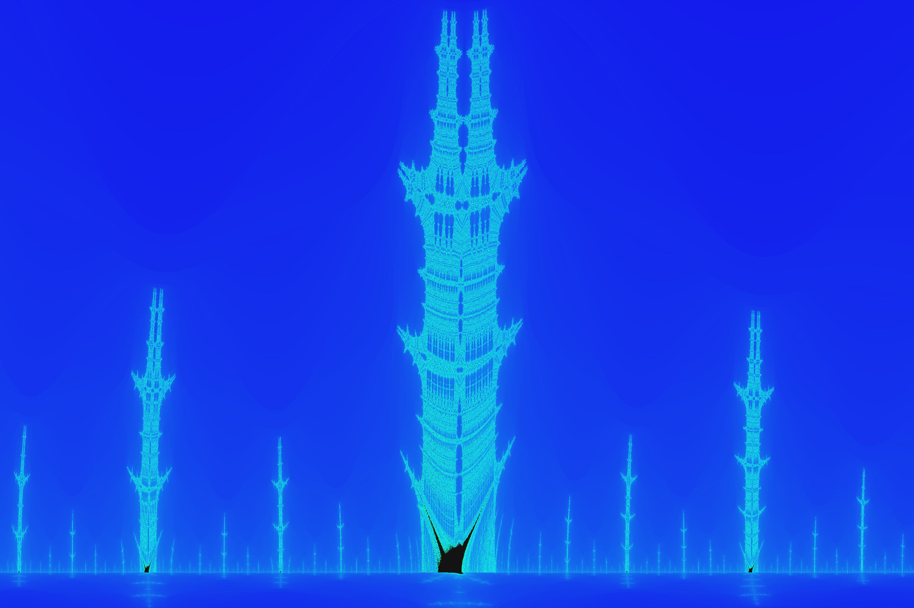
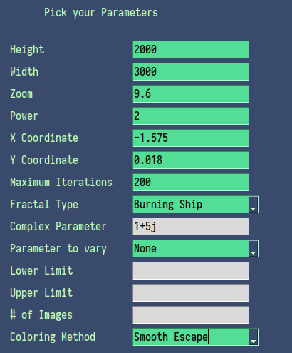
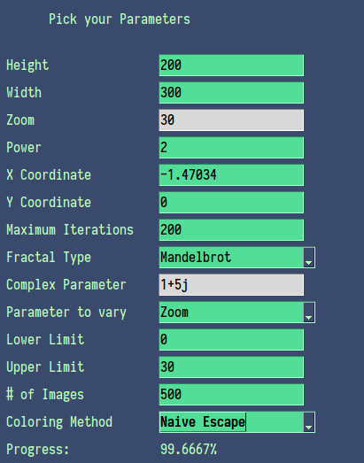

# Fractal-Visualizer
A python script with GUI made to visualize different types of fractals

## Installation
### Dependencies 
1. OpenCV2
2. Colorsys
3. Numpy
4. Scipy
5. PySimpleGUI
6. Numba
7. PIL

Install them all using pip 
```sh
pip install opencv-python colorsys numpy scipy PySimpleGUI numba pillow
```
In some cases, I've found that just installing PySimpleGUI isn't enough. In the case you get errors with PySimpleGUI not detecting Tkinter, try installing TKinter directly: 
```sh
pip install tk
```
After the dependencies are installed, just clone the directory, cd into the folder, and run the script using 
```sh
python3 main.py
```
or 
```sh
python main.py
```

This should render a GUI with which you can start generating your own fractal images!

## Usage 
### Parameters 
Parameter | Description
------------ | -------------
Height | Defines the height for the resolution of the final image 
Width | Defines the width for the resoltuion of the final image 
Zoom | Defines how much the program will zoom at any particular point. Generally staying under 20 should be enough, but larger values are supported 
Power | For the mandelbrot set, we can change the power used in the iteration function to get results like this (ADD LINK)
X Coordinate | x coordinate (real part) in the complex plane, which will be the center of the image 
Y Coordinate | y coordinate (imaginary part) of the complex plane, will be the center of the image 
Maximum iterations | Changing this changes the color detail of the image. Any value above 200 is enough. However larger numbers will cause significant CPU strain for no change in image quality. 
Fractal type | So far only Mandelbrot and Burning ship fractals have been implemented. Looking to implement more in the future! 
omplex parameter | (Unused so far) parameter for implementation of Julia set fractal 
Parameter to vary | This is used to create animations. This will create a series of images as per the 3 parameters below. This will not create a gif or a video, only a set of images (for now)
Lower Limit | Starting value of the parameter being varied 
Upper Limit | End point for the parameter being varied 
/# of images | Specifies the number of images which will be made 
Colorind Method | There are 3 methods to choose from. Naive escape creates a very rainbow-y image, Histogram creates a dualtone image, and smooth escape creates an image with nice gradients and lots of colors 
Compute button | starts creating the image 
Show Image! | Shows the last image that was created. Does not update after creating the image. 

After setting the required parameters, a folder called "Output" will be created in the same folder as the script. This will contain all the images created. 

Furthermore, due to limitations with my programming skills, you only get 3 attempts to enter the right set of parameters. If you enter incorrect information (e.g. enter "a" for a zoom value) it will crash. I am working on a fix, but this shouldn't be that much of a problem. 

### Examples 
Suppose you wish to create a 2000 by 3000 pixel image, which shows the burning ship fractal with 9.6x zoom at the complex number -1.575 + 0.018i, using the smooth coloring method. This would create an image like this: 



The configuration for such an image would look like this:



Supppose you wish to create an animation of the Mandelbrot set, on the complex number -1.47034+0i in the complex plane. This animation zooms in on this point, going from a zoom of 0 to 30, creating 500 images for a very smooth animation. The resolution of each image is 200 by 300 pixels, and the coloring method is naive escape to achieve a trance-like rainbow effect. The configuration for such an animation would be:



The end result will be a series of 500 images. Using another script, I have made them into a gif:


Of course, feel free to change the parameters to your heart's desire! By changing the coordinate, it is possible to make some very entracing images! I've done my best to reduce the limitations that you have to create the kind of fractal image you want. I will be working on adding more features to it in the future. Until then, I hope you enjoy!

## Creating GIFs 
Using the `gifMaker.py` script, it is possible to create a gif of the images created using the program. In order to create the right GIF, you will need to run the file using your terminal. From the same directory as the main script, run 
```sh
python3 gifMaker.py
```
or
```sh
python gifMaker.py
```

The resulting GIF should appear in the same directory as the scripts.
